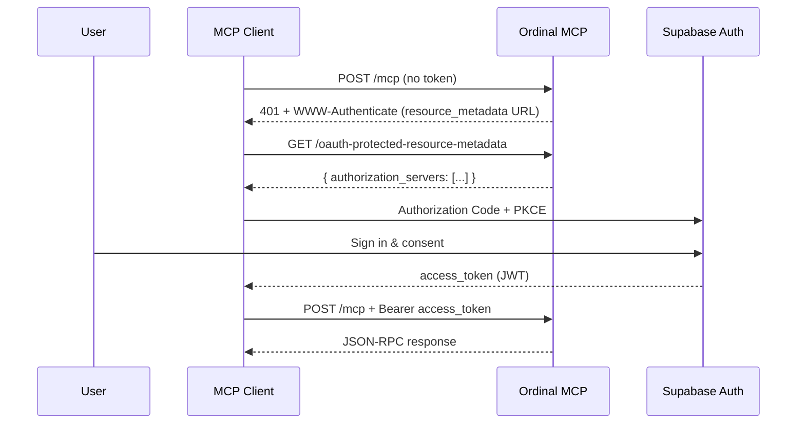

## Overview

The Ordinal MCP server is a **protected resource** in the [OAuth 2.1](https://datatracker.ietf.org/doc/html/draft-ietf-oauth-v2-1) sense. Your MCP client obtains a short-lived access token from the authorization server ([Supabase Auth](https://supabase.com/docs/guides/auth/oauth-server/getting-started)) and sends it on every MCP request:

```http
POST /mcp HTTP/1.1
Host: app.tryordinal.com
Authorization: Bearer <access_token>
Content-Type: application/json
```

<Info>
  Most users never see this. Modern MCP clients (Claude Desktop, Claude Code, Cursor, VS Code) drive the whole flow — you click "Sign in," a browser opens, and the client stores and refreshes the token automatically. This page is for client integrators and anyone debugging connection issues.
</Info>

## Discovery: Protected Resource Metadata

When an MCP client connects for the first time (or hits a `401`), it discovers how to authenticate by fetching the [RFC 9728](https://datatracker.ietf.org/doc/html/rfc9728) Protected Resource Metadata document:

<Card title="Metadata endpoint" icon="file-json">
  ```
  GET https://app.tryordinal.com/mcp/oauth-protected-resource-metadata
  ```
</Card>

Example response:

```json
{
  "resource": "https://app.tryordinal.com/mcp",
  "authorization_servers": [
    "https://<your-supabase-project>.supabase.co/auth/v1"
  ],
  "scopes_supported": ["openid", "email", "profile"]
}
```

The client uses `authorization_servers[0]` to continue with standard OAuth 2.1 discovery (the `.well-known/oauth-authorization-server` document) and begin the authorization code + PKCE flow.

## The authorization flow



The access token is a JWT issued by Supabase. The MCP server verifies it on every request: the signature, issuer, expiration, and the `aud` claim (which must match the MCP resource URL).

## The `WWW-Authenticate` challenge

A request without a valid token returns `401 Unauthorized` with a discovery hint in the response header:

```http
HTTP/1.1 401 Unauthorized
WWW-Authenticate: Bearer realm="mcp", resource_metadata="https://app.tryordinal.com/mcp/oauth-protected-resource-metadata"
Content-Type: application/json

{
  "jsonrpc": "2.0",
  "error": {
    "code": -32001,
    "message": "Missing credentials. Obtain a Supabase OAuth 2.1 access token (see WWW-Authenticate resource_metadata)."
  },
  "id": null
}
```

An expired or invalid token returns the same status with error code `-32002`:

```json
{
  "jsonrpc": "2.0",
  "error": {
    "code": -32002,
    "message": "Invalid or expired OAuth access token. Use a token from Supabase Auth OAuth 2.1."
  },
  "id": null
}
```

Compliant MCP clients read `resource_metadata`, refresh or re-acquire a token, and retry automatically.

## Scopes

The server advertises three scopes in Protected Resource Metadata:

| Scope | Purpose |
|-------|---------|
| `openid` | Identifies the user (required for OIDC). |
| `email` | Exposes the user's email — used to map the token to the user's Ordinal account. |
| `profile` | Standard OIDC profile claims. |

Authorization within the server is **user-based**, not scope-based: the token identifies *who* is calling, and every tool call is executed as that user against the `workspaceSlug` they pass in.

## Workspace access

Unlike the REST API (where an API key is scoped to a single workspace), an MCP access token represents a **user**. The user can operate across every workspace they belong to.

Each tool takes a `workspaceSlug` argument. Use `ordinal_get_workspace_context` with no arguments to list accessible workspaces, then pass the slug you want on subsequent calls.

## JSON-RPC error codes

| Code | Meaning |
|------|---------|
| `-32001` | Missing credentials. No `Authorization: Bearer <token>` header. |
| `-32002` | Invalid or expired access token. |
| `-32601` | Unsupported method (only `GET` and `POST` are accepted). |
| `-32603` | Internal server error during tool execution. |

## Troubleshooting

<AccordionGroup>
  <Accordion title="I keep getting 401 after signing in">
    - Confirm your client supports OAuth 2.1 with PKCE. Some older MCP clients only support static tokens — use the `mcp-remote` bridge (see [Install](/mcp/install)).
    - Verify the resource URL is exactly `https://app.tryordinal.com/mcp` (no trailing slash, no `/api/` prefix).
    - If the 401 persists, your token may have been issued for the wrong audience. Re-trigger the sign-in flow in your client.
  </Accordion>
  <Accordion title="My client can't find the authorization server">
    The client should hit `/mcp/oauth-protected-resource-metadata` and read `authorization_servers[0]`. If the metadata endpoint returns an error, Ordinal's OAuth configuration may be temporarily unavailable — contact support.
  </Accordion>
  <Accordion title="How long do access tokens last?">
    Access tokens are short-lived (typically one hour). Supabase issues refresh tokens alongside them; your MCP client uses the refresh token transparently to mint new access tokens. You shouldn't need to re-sign-in until the refresh token itself expires.
  </Accordion>
  <Accordion title="Can I use a raw API key instead?">
    No. The MCP v2 server only accepts Supabase-issued OAuth access tokens. If you need key-based access, use the [REST API](/api/introduction).
  </Accordion>
</AccordionGroup>

## Need Help?

<CardGroup cols={2}>
  <Card title="Install" icon="plug" href="/mcp/install">
    Client-by-client setup — OAuth handled automatically.
  </Card>
  <Card title="Tools reference" icon="book" href="/mcp/tools">
    Every tool the MCP server exposes.
  </Card>
</CardGroup>
